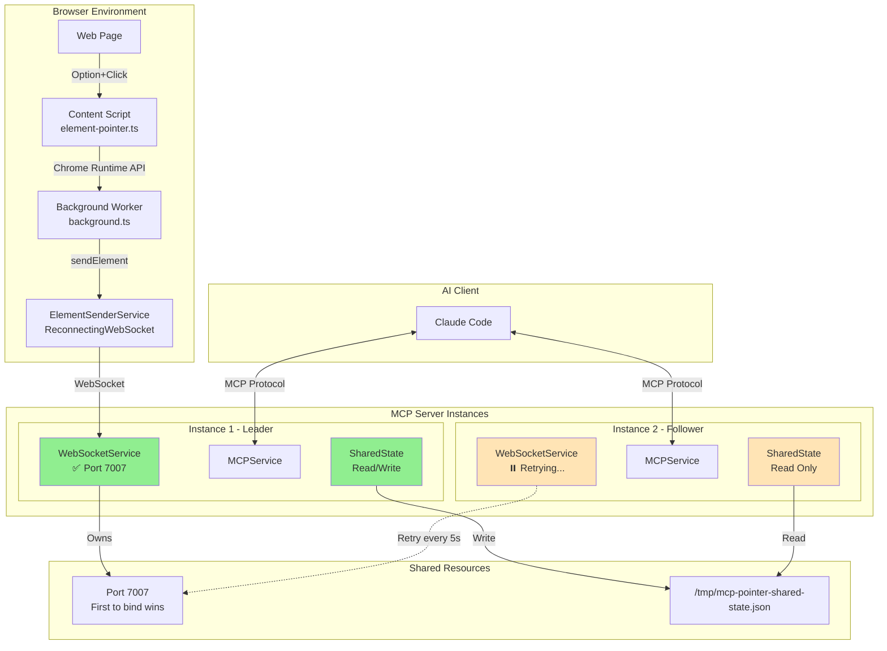
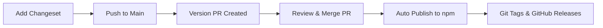

# 🤝 贡献 MCP Pointer

**Languages**: [English](./CONTRIBUTING.md) · **简体中文**

感谢你想为 MCP Pointer 贡献！本指南会带你搭建开发环境并了解贡献流程。

## 📋 前置条件

- **Node.js** 18+
- **pnpm**（必需，见下文 [包管理器](#-包管理器)）
- **Chrome** 浏览器（用于扩展调试）
- **Claude Code** 或其它 MCP 兼容的 AI 工具（用于联调）

## 📦 包管理器

**重要：** 本项目只能用 **pnpm**。npm / yarn 不行，原因：

- workspace 用了 `catalog:` 依赖
- 构建工具针对 pnpm 做了优化
- 团队统一 lockfile

### 安装 pnpm

```bash
# 通过 npm 安装
npm install -g pnpm

# 通过 Homebrew（macOS）
brew install pnpm

# 通过脚本
curl -fsSL https://get.pnpm.io/install.sh | sh
```

## 📦 发布与构建

通过 GitHub Actions 自动发布，附带加密 provenance，保证安全性和透明度。

### 构建系统

- **包管理器**：pnpm + workspaces
- **构建工具**：esbuild（极速 TypeScript 编译）
- **CLI 分发**：单文件 bundle 的 `.cjs`，可独立运行
- **依赖**：所有外部依赖都打包进 bundle，安装时零依赖

### 发布流程

1. **自动 CI**：每次 push / PR 都跑 lint、type check、build
2. **GitHub Releases**：创建 release 即触发自动发布 npm
3. **Provenance**：把发布包与源码以加密方式绑定
4. **透明**：用户可以验证发布的 CLI 与开源代码一致

```bash
# 用 tag 触发发布
git tag v0.1.0
git push origin v0.1.0
# 也可以用 GitHub 的 release UI
```

## 🏗 项目结构

```
packages/
├── server/              # @mcp-pointer/server —— MCP Server（TypeScript）
│   ├── src/
│   │   ├── start.ts                 # 服务入口
│   │   ├── cli.ts                   # 命令行入口（commander）
│   │   ├── commands.ts              # `start` / `config` 命令路由
│   │   ├── config.ts                # 旧版单 agent 安装入口
│   │   ├── config/
│   │   │   ├── adapters/            # 一个 AI 工具一个 adapter
│   │   │   │   ├── claude.ts
│   │   │   │   ├── cursor.ts
│   │   │   │   ├── windsurf.ts
│   │   │   │   ├── codex.ts         # 基于 TOML 的配置
│   │   │   │   ├── opencode.ts
│   │   │   │   ├── joycode.ts       # 用户级 prompt.json
│   │   │   │   └── index.ts         # adapter 注册表
│   │   │   ├── orchestrator.ts      # runInteractiveInstall / runInteractiveUninstall / executeForAgents
│   │   │   ├── prompts.ts           # @inquirer/prompts 包装
│   │   │   ├── scope.ts             # resolveScope（user|project，含 TTY 回退）
│   │   │   ├── trigger-content.ts   # 斜杠命令 / skill 的单一内容源
│   │   │   ├── adapter-helpers.ts   # JSON/TOML/文件辅助函数
│   │   │   └── types.ts             # ToolAdapter 契约（install + 对称的 uninstall）
│   │   ├── message-handler.ts       # 消息路由与状态构造
│   │   ├── services/
│   │   │   ├── websocket-service.ts        # 带 leader 选举的 WebSocket
│   │   │   ├── mcp-service.ts              # MCP 协议处理
│   │   │   ├── element-processor.ts        # Raw → Processed 转换
│   │   │   └── shared-state-service.ts     # 选区 batch 持久化
│   │   └── utils/
│   │       ├── dom-extractor.ts            # HTML 解析
│   │       └── element-detail.ts           # 动态 CSS / 文本筛选
│   ├── dist/cli.cjs                        # 打包后的独立 CLI
│   └── package.json
│
├── chrome-extension/    # Chrome 扩展（TypeScript，MV3）
│   ├── src/
│   │   ├── background.ts                   # Service worker（路由 SELECTION_SENT）
│   │   ├── content.ts                      # ISOLATED world 入口
│   │   ├── popup.ts / popup.html / popup.css  # 弹窗 UI + server 状态
│   │   ├── isolated-world/
│   │   │   └── request-component-info.ts   # ISOLATED → MAIN 桥（请求侧）
│   │   ├── main-world/
│   │   │   └── extractor-main.ts           # MAIN world 监听（读 Fiber / Vue 实例）
│   │   ├── extractors/                     # 框架组件提取器
│   │   │   ├── react.ts
│   │   │   ├── vue.ts
│   │   │   ├── index.ts                    # 使用 ComponentExtractor 接口编排
│   │   │   └── types.ts
│   │   ├── services/
│   │   │   ├── element-pointer-service.ts          # Option+Click 捕获
│   │   │   ├── element-sender-service.ts           # WebSocket 客户端
│   │   │   ├── overlay-manager-service.ts          # 多 overlay 渲染
│   │   │   ├── selection-store-service.ts          # 有序多选 batch
│   │   │   ├── note-panel-service.ts               # 浮动编辑器（Send / Copy / ×）
│   │   │   ├── server-reachability-service.ts      # 弹窗 server 探测
│   │   │   ├── popup-manager-service.ts
│   │   │   ├── config-storage-service.ts
│   │   │   ├── trigger-key-service.ts
│   │   │   └── trigger-mouse-service.ts
│   │   ├── styles.css                      # overlay、chip、note panel、flash 样式
│   │   └── manifest.json
│   ├── dev/                                # 开发构建（带日志 + sourcemap）
│   └── dist/                               # 生产构建（minified）
│
└── shared/             # @mcp-pointer/shared —— 共享 TS 类型
    ├── src/
    │   ├── logger.ts                       # Node 日志走 stderr（避免污染 MCP stdout）
    │   ├── types.ts                        # 通信类型，含 RawPointedSelection batch + SELECTION_SENT
    │   └── detail.ts                       # CSS / 文本详略常量
    └── package.json
```

## 🚀 开发环境搭建

### 1. Fork 并克隆

```bash
# 在 GitHub 上 fork，然后克隆你的 fork
git clone https://github.com/etsd-tech/mcp-pointer.git
cd mcp-pointer

# 加 upstream
git remote add upstream https://github.com/etsd-tech/mcp-pointer.git
```

### 2. 安装依赖

```bash
pnpm install
```

### 3. 构建所有包

```bash
pnpm build
```

## 🏗️ 系统架构

MCP Pointer 是分布式架构：多个 server 实例 + leader 选举，提供高可用。



### 工作原理

#### 服务端（多实例）

1. **Leader 选举**：
   - 可以同时跑多个 MCP server 实例
   - 第一个 bind 上 7007 端口的实例成为 leader
   - 其它实例为 follower，每 5 秒重试一次
   - leader 崩溃后约 5 秒内自动故障切换

2. **状态管理**：
   - Leader 把元素数据写入 `/tmp/mcp-pointer-shared-state.json`
   - 所有实例（leader / follower）都能读共享状态
   - 任意实例都能服务 MCP 请求

3. **服务架构**：
   - **WebSocketService**：负责端口选举和 WebSocket 连接
   - **MCPService**：实现 MCP 协议
   - **SharedStateService**：通过文件系统持久化状态

#### 客户端（浏览器扩展）

1. **连接管理（ElementSenderService）**：
   - 使用 ReconnectingWebSocket 库保证连接稳定
   - 指数退避：最小 1s，最大 10s，倍率 1.5
   - 每次连接最多重试 5 次
   - 连接超时 5s
   - 空闲 2 分钟自动断开

2. **元素选择流程**：
   - Content script 在 Option+Click 时捕获元素数据
   - 通过 Chrome Runtime API 发给 background worker
   - background worker 用 ElementSenderService 通过 WebSocket 发出去
   - 连接状态回调给用户反馈（CONNECTING → CONNECTED → SENDING → SENT）

3. **韧性特性**：
   - server 重启或 leader 变更时自动重连
   - 端口变化处理（断旧连接、连新端口）
   - 详细连接状态日志
   - 失败时优雅地上报状态

## 🛠 开发流程

### Chrome 扩展开发

1. **开发模式构建**：
   ```bash
   cd packages/chrome-extension
   pnpm dev  # 构建到 dev/，带日志 + sourcemap
   ```

2. **在 Chrome 中加载**：
   - Chrome → 扩展 → 开发者模式 → 加载已解压
   - 选 `packages/chrome-extension/dev/`

3. **修改代码**：
   - dev 模式下文件被 watch
   - 改完在扩展页点刷新
   - 浏览器 console 看开发日志

4. **Dev vs Production**：
   - **Dev**（`pnpm dev`）→ `dev/`，带日志和 sourcemap
   - **Prod**（`pnpm build`）→ `dist/`，minified、无日志

### MCP Server 开发

1. **watch 模式跑 server**：
   ```bash
   cd packages/server
   pnpm dev  # 文件改了自动重启
   ```

2. **本地测试 server**：
   ```bash
   # 另开一个终端
   node dist/cli.cjs --help  # 跑下打包后的 CLI
   ```

3. **开发期配置**：
   ```bash
   # 交互式（推荐）—— 一次性为多个 agent 装/卸 MCP + 斜杠 + skill
   pnpm -C packages/server build && node packages/server/dist/cli.cjs config

   # 或者旧版单 agent 形式
   node packages/server/dist/cli.cjs config claude --scope project
   ```

### 常用命令

```bash
# 生产构建
pnpm build

# lint + 类型检查
pnpm lint
pnpm typecheck

# 自动修 lint
pnpm lint:fix

# 清理构建产物
pnpm -C packages/chrome-extension clean
pnpm -C packages/server clean

# 并行跑所有包的 dev
pnpm dev
```

## 🧪 测试

### PR 前自查清单

- [ ] `mcp-pointer start` 能启动 MCP server
- [ ] Chrome 扩展加载没有报错
- [ ] Option+Click 能高亮元素，并叠加成多选 batch
- [ ] Note panel 出现，含 Send / Copy / × 三个按钮
- [ ] Send（⌘/Ctrl+Enter）发出 `{ userNote, elements: [...] }` 到 server
- [ ] 弹窗在 server 启停时分别显示 🟢 / 🔴
- [ ] Claude Code 看到 `get-pointed-element` 工具，且返回 batch
- [ ] 至少一个 adapter 的交互式 `config` 安装 + 卸载都通
- [ ] `pnpm test` 全部通过
- [ ] 新功能有对应测试

### 测试场景

1. **不同网站**：React 应用、Vue 应用、纯 HTML
2. **组件识别**：React 应用应能看到 Fiber 信息
3. **响应式**：缩放浏览器，观察高亮
4. **CSS 抽取**：确认样式和位置被正确捕获
5. **边界场景**：超小元素、重叠元素等

### 浏览器测试

- ✅ **Chrome** —— 主目标，需充分测试
- ✅ **Edge** —— 行为应与 Chrome 一致
- 🟡 **Firefox** —— 扩展需要适配（欢迎贡献）
- 🟡 **Safari** —— 扩展需要适配（欢迎贡献）

## 📝 代码风格

### 通用约定

- 所有代码使用 **TypeScript**
- 跟随现有代码风格和约定
- 用 **esbuild** 编译（已配置好）
- 公共 API 写 JSDoc
- 显式类型优于 `any`

### 格式化

- 用 **ESLint** 做 lint + 格式化
- 提交前跑 `pnpm lint:fix`
- 所有代码必须通过 `pnpm typecheck`

### 命名

- 文件用 **kebab-case**：`element-sender-service.ts`
- 类 / 组件用 **PascalCase**
- 函数 / 变量用 **camelCase**

## 🔄 修改流程

### 分支命名

```bash
# 功能分支
git checkout -b feature/add-firefox-support
git checkout -b feature/improve-react-detection

# Bug 修复
git checkout -b fix/websocket-reconnection
git checkout -b fix/element-highlighting-edge-case

# 文档
git checkout -b docs/update-contributing-guide
```

### 提交信息

使用 conventional commit 格式：

```
type(scope): description

例：
feat(extension): add Firefox support
fix(server): handle WebSocket reconnection
docs(readme): update installation instructions
refactor(shared): improve TypeScript types
test(extension): add element selection tests
```

### PR 流程

1. **聚焦** —— 一个 PR 只做一件事
2. **更新文档** —— 必要时更新 README 等
3. **加测试** —— 新功能配套测试
4. **构建通过** —— `pnpm build` 必须成功
5. **质量检查**：
   ```bash
   pnpm lint
   pnpm typecheck
   pnpm build
   ```

### PR 描述模板

```markdown
## Summary
简要说明这个 PR 做了什么

## Changes Made
- 列出关键改动
- 包含任何 breaking change
- 提到新增依赖

## Testing
- [ ] 本地用 Chrome 扩展测过
- [ ] 测过 MCP server 功能
- [ ] 测过和 Claude Code 的集成
- [ ] 所有已有测试通过

## Screenshots (if applicable)
UI 改动请贴截图
```

## 🐛 开发问题排查

### 常见问题

1. **构建失败**：
   - 确认用的是 pnpm，不是 npm/yarn
   - 跑 `pnpm install` 刷新依赖
   - 用 `pnpm typecheck` 检查 TS 错误

2. **扩展加载失败**：
   - 确认用 `pnpm -C packages/chrome-extension build` 构建过
   - 检查 `dist/` 或 `dev/` 目录有产物
   - 在扩展页重新加载

3. **WebSocket 连接问题**：
   - 确认 MCP server 已启动（`mcp-pointer start`）
   - 7007 端口没被占
   - 浏览器 console 看连接报错

4. **Claude Code 看不到 MCP 工具**：
   - 配置变更后重启 Claude Code
   - 确认 `.mcp.json` 存在且合法
   - 查 MCP server 日志

### 求助

- 先看 [GitHub Issues](https://github.com/etsd-tech/mcp-pointer/issues)
- 新建 issue 请附：
  - 清晰描述
  - 复现步骤
  - 环境信息（OS、Node 版本等）
  - 报错或日志

## 📋 发布流程

本项目使用 **Changesets** 做自动化版本与发布。贡献者添加 changeset 描述变更，维护者通过自动化 PR 管理发布。

### 使用 Changesets

每次变更需要触发发布时，添加 changeset：

```bash
pnpm changeset
```

会提示你：

1. **选择需要更新的包**
2. **选择版本类型**（patch/minor/major）
3. **写变更摘要**

例：
```
🦋  Which packages would you like to include?
◉ @mcp-pointer/server
◉ @mcp-pointer/shared
◯ @mcp-pointer/chrome-extension

🦋  Which packages should have a major bump?
◯ @mcp-pointer/server
◯ @mcp-pointer/shared

🦋  Which packages should have a minor bump?
◉ @mcp-pointer/server
◯ @mcp-pointer/shared

🦋  Please enter a summary for this change
Added WebSocket connection retry logic with exponential backoff
```

### 版本类型

- **Patch**（0.1.0 → 0.1.1）：bug fix、小改进
- **Minor**（0.1.0 → 0.2.0）：新功能，向后兼容
- **Major**（0.1.0 → 1.0.0）：破坏性变更

### 发布动作

**仅限维护者：**

1. **检查 `.changeset/` 里的 pending changeset**
2. **push 到 main** —— GitHub Actions 会创建 "Version Packages" PR
3. **review Version PR** —— 检查版本号 + changelog
4. **合并 Version PR** —— 自动发布

自动化流程会：

- 打 git tag（例如 `@mcp-pointer/server@0.3.1`）
- 带 provenance 发布到 npm
- 创建 GitHub release 与 changelog
- 处理 monorepo 版本

### 发布流程图



## 🎯 贡献方向

不知道做什么？参考：

### 🚀 功能
- Firefox 扩展支持
- Safari 扩展支持
- 更多框架识别（Svelte、Angular）
- 元素搜索 / 过滤
- 元素数据多格式导出
- 接入更多 AI 工具

### 🐛 Bug 修复
- 提升元素高亮精度
- 处理组件识别的边界情况
- WebSocket 连接稳定性
- 性能优化

### 📚 文档
- 更丰富的示例
- 视频教程
- 接入不同 AI 工具的指南
- 翻译

### 🧪 测试
- 核心功能单测
- 集成测试
- 跨浏览器测试
- 性能测试

## 📄 许可证

为 MCP Pointer 贡献即表示你同意以 MIT License 授权你的贡献。

---

**感谢贡献 MCP Pointer！👆**

每一份贡献都让 AI 驱动的 Web 开发更强大、更易用。
